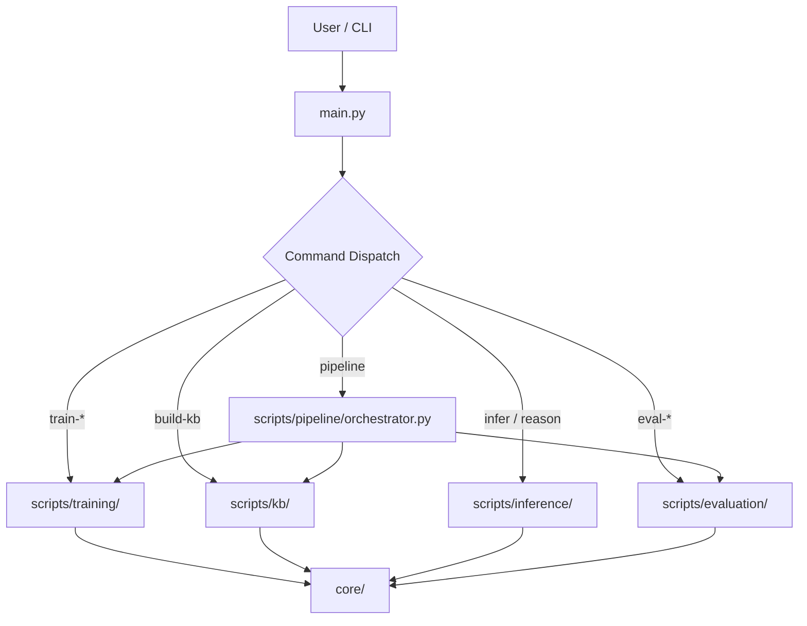

# Project Flow & Structure

This document outlines the architecture and data flow of the Research RAG pipeline.

## High-Level Architecture

The project is structured around a central orchestration script (`main.py`) that delegates tasks to specialized CLI scripts in `scripts/`, which in turn utilize the core logic defined in `core/`.

## Directory Structure

### 1. Root Directory
-   **`main.py`**: The primary entry point. Parses arguments and subprocesses the appropriate script from `scripts/`.
-   **`configs/`**: YAML configuration files for the pipeline.
-   **`outputs/`**: Generated artifacts (models, logs, results).

### 2. Scripts (`scripts/`)
Contains the executable logic for each command.
-   **`pipeline/`**: `orchestrator.py` manages the sequential execution of other stages.
-   **`training/`**: Scripts for `train_lora.py` and `train_fusion.py`.
-   **`kb/`**: Scripts for building the FAISS index (`build_kb.py`).
-   **`inference/`**: Scripts for running queries (`run_single_query.py`) and reasoning (`run_counterfactuals.py`).
-   **`evaluation/`**: Detailed evaluation suites for Retrieval, Encoders, LoRA, etc.

### 3. Core Logic (`core/`)
The heavy lifting and reusable modules.
-   **`embeddings/`**:
    -   Handles loading of models (CLIP, etc.).
    -   LoRA adapter logic.
-   **`fusion/`**:
    -   Multimodal fusion mechanisms (combining Text + Image embeddings).
-   **`kb/`**:
    -   Knowledge Base management.
    -   FAISS indexing and search operations.
-   **`reasoning/`**:
    -   Counterfactual generation logic.
    -   Stability analysis.
-   **`retrieval/`**:
    -   Search algorithms and ranking logic.

## Data Flow (Pipeline)

1.  **Input Data**: Raw images and text in `data/`.
2.  **Training**:
    -   **LoRA**: Fine-tunes encoders on domain data.
    -   **Fusion**: Trains the fusion layer to align modalities.
    -   *Outputs*: Saved models in `outputs/models/`.
3.  **KB Building**:
    -   Processes data using trained models.
    -   Generates embeddings.
    -   Builds FAISS index.
    -   *Outputs*: Index files in `outputs/kb/`.
4.  **Inference/Evaluation**:
    -   Loads the KB index and Models.
    -   Accepts User Queries.
    -   Retrieves relevant context.
    -   Generates answers or metrics.
