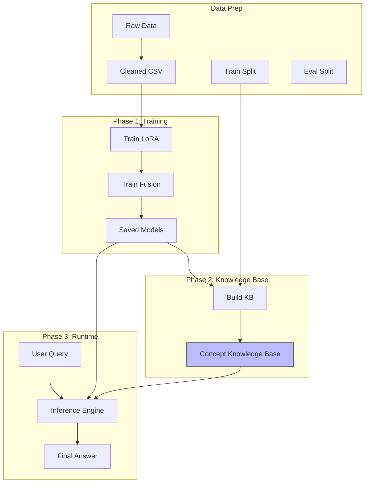
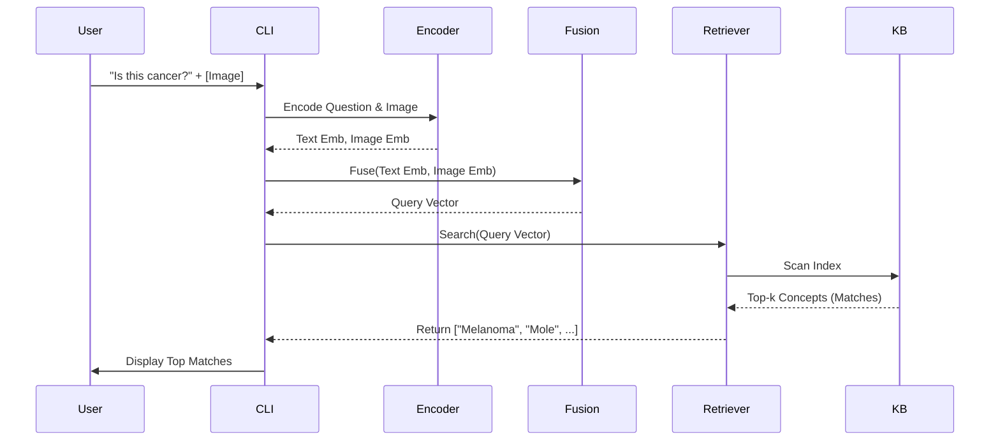

# Project Flowcharts

This document visualizes the **Research RAG** pipeline using flowcharts.

## 1. Complete Pipeline Overfiew



---

## 2. Concept-Based KB Construction (Detailed)

This explains how we turn raw data into a clean "Concept" index (`scripts/kb/build_kb.py`).

```mermaid
flowchart LR
    A[Raw Images (e.g. 50 photos of 'Rash')] --> B{Group by Description}
    B --> C[Concept Group: 'Rash Type A']
    
    subgraph Processing One Concept
        C --> D[Embed All 50 Images]
        D --> E[Aggregate (Mean)]
        E --> F[Prototypical Image Vector]
        
        C --> G[Canonical Text Description]
        G --> H[Text Encoder]
        H --> I[Text Vector]
        
        F --> J{Adaptive Fusion}
        I --> J
        J --> K[Final Concept Vector]
    end
    
    K --> L[(FAISS Index)]
```

---

## 3. Inference Logic

What happens when you run `python main.py infer`.



---

## 4. Comprehensive Architecture (Detailed)

This diagram consolidates the training and inference flows, correcting the "RAG ONE..." label from earlier diagrams to "Retrieval & Counterfactual Reasoning".

```mermaid
graph TD
    %% Phase 1: Offline Training
    subgraph Training [Phase 1: Offline Training]
        direction TB
        LORA_DATA[Training Data] --> LORA_TRAIN[LoRA Training<br/>(Image/Text Encoders)]
        LORA_TRAIN --> FUSION_TRAIN[Fusion Training]
        
        LORA_TRAIN --> KB_BUILD[Concept KB Building]
        FUSION_TRAIN --> KB_BUILD
        
        KB_BUILD --> KB[(Knowledge Base<br/>FAISS Index)]
    end

    %% Phase 2: Inference
    subgraph Inference [Phase 2: RAG + Reasoning]
        direction TB
        USER[User Query<br/>(Image + Text)] --> ENCODERS[Multimodal Encoders<br/>(with LoRA)]
        
        ENCODERS --> FUSION_INF{Adaptive Fusion}
        
        FUSION_INF --> RETRIEVE[Retrieve Top K<br/>(Stability Search)]
        KB --> RETRIEVE
        
        RETRIEVE --> REASONING[Counterfactual Reasoning<br/>(Diagnostics & Explanations)]
        
        REASONING --> OUTPUT[Final Output<br/>(Diagnosis + Explanation)]
    end
    
    %% Style
    style KB fill:#f9f,stroke:#333,stroke-width:2px
    style REASONING fill:#bbf,stroke:#333,stroke-width:2px
    style FUSION_INF fill:#ff9,stroke:#333,stroke-width:2px
```
